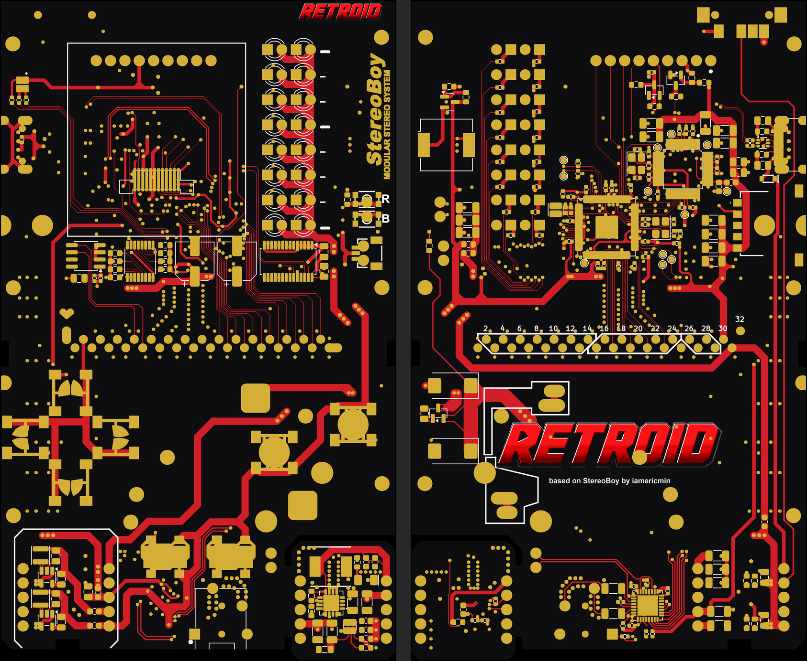

# StereoBoy – Retroid build

A ready-to-order build of [iamericmin's StereoBoy](https://github.com/iamericmin/StereoBoy_Firmware) ([Hackaday](https://hackaday.io/project/205771-stereoboy)), prepared in October 2026. **Not ordered yet** — this folder holds everything needed to pick it up again.

## What changed compared to the original

| Area | Change |
|---|---|
| Firmware | `src/hw_config.c` reads the cartridge SD card over **SPI1** (CS = GPIO2), matching the published StereoMag cartridge. SDIO stays available with `-DSB_SD_SDIO=ON`. Prebuilt: [`firmware/StereoBoy_FW_sd-spi.uf2`](firmware/) (builds, not yet tested on hardware). |
| Board look | White solder mask + JLCPCB **multi-colour silkscreen**: black board, red tracks, gold pads. Signatures, quote, bear logo and "ENGINEERING PROTOTYPE" removed; **RETROID** logo added on both sides, plus a "based on StereoBoy by iamericmin" credit. Electrically unchanged (KiCad DRC: 0 unconnected, 0 schematic-parity issues). |
| KiCad | [`kicad/hoofdprint/`](kicad/hoofdprint/) is the branded main board (KiCad 10). The drill/place origin is set to the board's bottom-left corner so the Gerbers line up with the EasyEDA colour files. |
| Parts | BOM fixed against the designer's own parts lists. Notable: TPS61090 (not TPS61092), SN74HC165**PWR** (TSSOP footprint), FM24**CL**64B (3.3 V), APX803S-31, VS1053B. Out-of-stock parts replaced (see `BESTELLEN.md`). |

## Folder contents

- `productie/hoofdprint/gerbers_hoofdprint_KLEUR.zip` – KiCad Gerbers + the four `Fabrication_Colorful*` files from EasyEDA Pro. Upload this one.
- `productie/hoofdprint/JLCPCB_BOM.csv`, `JLCPCB_CPL.csv` – 70 BOM lines / 184 placements, every line has a verified LCSC number. VR1 (thumb wheel) and D17 (RGB LED) are left out on purpose (hand-solder / optional).
- `productie/cartridge/` – StereoMag dev-kit cartridge (2 layers, 1.0 mm): Gerbers, BOM, CPL.
- `artwork/` – 1200 dpi colour artwork (exact board size), previews, the RETROID wordmark, outline DXFs, and the EasyEDA colour files.
- `scripts/` – how the artwork was made: KiCad SVG plots → PNG (`colorart.py`, `colorart_brand.py`), and `origin_dxf.py` (aux origin + outline DXF).
- `BESTELLEN.md` – step-by-step JLCPCB checklist (Dutch).
- `StereoBoy_bestellijst.xlsx` – full parts list, cartridge, enclosure/donor-GBP parts, known issues (Dutch).

## JLCPCB settings that matter

4 layers · **1.0 mm** · White · **ENIG 1U** · min via **0.2 mm** · Advanced Options → Silkscreen Technology → **EasyEDA multi-color silkscreen** · Confirm Production File: Yes · PCBA Standard, **both sides**, qty 2, Confirm Parts Placement: Yes. Tick J7 (USB-C) by hand in the BOM step — JLC deselects it ("processing difficult").

Quote on 1 Oct 2026: **$387.77** (PCB $84.83 + PCBA $302.94, excl. shipping). Most of it is one-off cost (setup, stencil, fixture, ~$107 extended-part feeder fees), so 5 assembled boards cost far less per unit than 2. Swapping ~10 passives to JLC "Basic" parts would save roughly $25–35.

## Still open

- **Music library script.** The firmware expects `.artists.sbc` / `.albums.sbc` / `.tracks.sbc` (+ `artwork.lut/bin`) on the SD card; the generator script is not in the original repo.
- Colour silkscreen + KiCad Gerbers is not an official JLC flow: check the colours in JLC's production-file preview before approving.
- Cartridge DRC: I2S_WSEL/BCLK swapped at the 2×10 dev header and the reset RC unconnected — harmless unless J2 is used.

## Licensing note

The upstream repository has no licence file. The cartridge KiCad files come from the designer's [Hackaday files page](https://hackaday.io/project/205771/files). All credit for the hardware and firmware goes to iamericmin and team; RETROID branding is ours.
